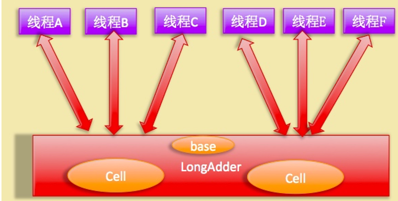

# 第4章 Java并发包中原子操作类原理剖析

## 原子变量操作类

JUC包中有AtomicInteger、AtomicLong和AtomicBoolean等原子性操作类，它们原理类似，下面以AtomicLong为例进行讲解。

### 递增和递减操作代码

```java
public final long getAndIncrement() {
    return unsafe.getAndAddLong(this, valueOffset, 1L);
}

public final long getAndDecrement() {
    return unsafe.getAndAddLong(this, valueOffset, -1L);
}

public final long incrementAndGet() {
    return unsafe.getAndAddLong(this, valueOffset, 1L) + 1L;
}

public final long decrementAndGet() {
    return unsafe.getAndAddLong(this, valueOffset, -1L) - 1L;
}
```
上述代码中，valueOffset为AtomicLong在static语句块中进行初始化时通过Unsafe类获得的本类中value属性的内存偏移。

可以看到，上述四个方法都是基于Unsafe类中的getAndAddLong方法实现的。

getAndAddLong源码如下

```java
public final long getAndAddLong(Object var1, long var2, long var4) {
    long var6;
    //CAS操作设置var1对象偏移为var2处的值增加var4
    do {
        var6 = this.getLongVolatile(var1, var2);
    } while(!this.compareAndSwapLong(var1, var2, var6, var6 + var4));

    return var6;
}
```

### compareAndSet方法

```java
public final boolean compareAndSet(long expect, long update) {
    return unsafe.compareAndSwapLong(this, valueOffset, expect, update);
}
```

可见，内部还是调用了Unsafe类中的CAS方法。

### AtomicLong使用示例

```java
public class AtomicLongDemo {
    private static AtomicLong al = new AtomicLong(0);

    public static long addNext() {
        return al.getAndIncrement();
    }

    public static void main(String[] args) {
        for (int i = 0; i < 100; i++) {
            new Thread() {
                @Override
                public void run() {
                    AtomicLongDemo.addNext();
                }
            }.start();
        }

        // 等待线程运行完
        try {
            TimeUnit.SECONDS.sleep(1);
        } catch (InterruptedException e) {
            e.printStackTrace();
        }

        System.out.println("final result is " + AtomicLongDemo.addNext());
    }
}
```
AtomicLong使用CAS非阻塞算法，性能比使用synchronized等的阻塞算法实现同步好很多。但在高并发下，大量线程会同时去竞争更新同一个原子变量，由于同时只有一个线程的CAS会成功，会造成大量的自旋尝试，十分浪费CPU资源。因此，JDK8中新增了原子操作类LongAdder。

## JDK8中新增的原子操作类LongAdder

由上可知，AtomicLong的性能瓶颈是多个线程同时去竞争一个变量的更新权导致的。而LongAdder通过将一个变量分解成多个变量，让同样多的线程去竞争多个资源解决了此问题。

### 原理



如图，LongAdder内部维护了多个Cell，每个Cell内部有一个初始值为0的long类型变量，这样，在同等并发下，对单个变量的争夺会变少。此外，多个线程争夺同一个变量失败时，会到另一个Cell上去尝试，增加了重试成功的可能性。当LongAdder要获取当前值时，将所有Cell的值于base相加返回即可。

LongAdder维护了一个初始值为null的Cell数组和一个基值变量base。当一开始Cell数组为空且并发线程较少时，仅使用base进行累加。当并发增大时，会动态地增加Cell数组的容量。

Cell类中使用了@sun.misc.Contented注解进行了字节填充，解决了由于连续分布于数组中且被多个线程操作可能造成的**伪共享**问题(关于伪共享，可查看[《伪共享（false sharing），并发编程无声的性能杀手》](https://www.cnblogs.com/cyfonly/p/5800758.html)这篇文章)。

### 源码分析

先看LongAdder的定义

```java
public class LongAdder extends Striped64 implements Serializable
```

Striped64类中有如下三个变量：
```java

transient volatile Cell[] cells;

transient volatile long base;

transient volatile int cellsBusy;
```

cellsBusy用于实现自旋锁，状态值只有0和1，当创建Cell元素、扩容Cell数组或初始化Cell数组时，使用CAS操作该变量来保证同时只有一个变量可以进行其中之一的操作。

下面看Cell的定义：

```java
@sun.misc.Contended static final class Cell {
    volatile long value;
    Cell(long x) { value = x; }
    final boolean cas(long cmp, long val) {
        return UNSAFE.compareAndSwapLong(this, valueOffset, cmp, val);
    }

    // Unsafe mechanics
    private static final sun.misc.Unsafe UNSAFE;
    private static final long valueOffset;
    static {
        try {
            UNSAFE = sun.misc.Unsafe.getUnsafe();
            Class<?> ak = Cell.class;
            valueOffset = UNSAFE.objectFieldOffset
                (ak.getDeclaredField("value"));
        } catch (Exception e) {
            throw new Error(e);
        }
    }
}
```

将value声明伪volatile确保了内存可见性，CAS操作保证了value值的原子性，@sun.misc.Contented注解的使用解决了伪共享问题。

下面来看LongAdder中的几个方法：

- long Sum()

```java
public long sum() {
    Cell[] as = cells; Cell a;
    long sum = base;
    if (as != null) {
        for (int i = 0; i < as.length; ++i) {
            if ((a = as[i]) != null)
                sum += a.value;
        }
    }
    return sum;
}
```
sum的结果并非一个精确值，因为计算总和时并没有对Cell数组加锁，累加过程中Cell的值可能被更改。

- void reset()

```java
public void reset() {
    Cell[] as = cells; Cell a;
    base = 0L;
    if (as != null) {
        for (int i = 0; i < as.length; ++i) {
            if ((a = as[i]) != null)
                a.value = 0L;
        }
    }
}
```
reset非常简单，将base和Cell数组中非空元素的值置为0.

- long sumThenRest()

```java
public long sumThenReset() {
    Cell[] as = cells; Cell a;
    long sum = base;
    base = 0L;
    if (as != null) {
        for (int i = 0; i < as.length; ++i) {
            if ((a = as[i]) != null) {
                sum += a.value;
                a.value = 0L;
            }
        }
    }
    return sum;
}
```
sumThenReset同样非常简单，将某个Cell的值加到sum中后随即重置。

- void add(long x)

```java
public void add(long x) {
    Cell[] as; long b, v; int m; Cell a;
    if ((as = cells) != null || !casBase(b = base, b + x)) {
        boolean uncontended = true;
        if (as == null || (m = as.length - 1) < 0 ||
            (a = as[getProbe() & m]) == null ||
            !(uncontended = a.cas(v = a.value, v + x)))
            longAccumulate(x, null, uncontended);
    }
}
```


