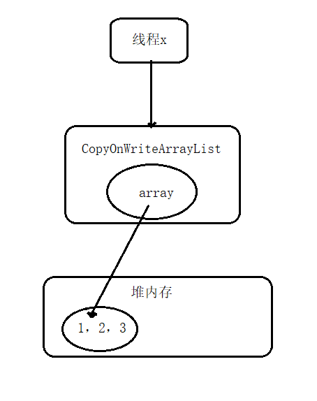
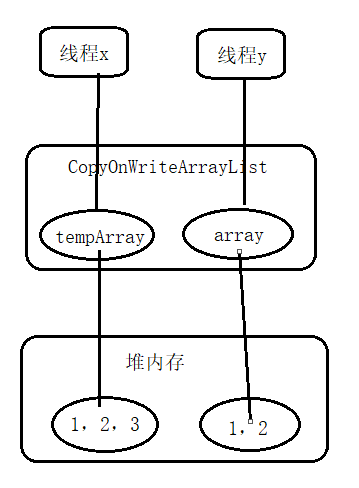
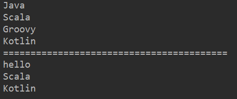

# 第5章 Java并发包中并发List源码剖析

## 目录

- [介绍](#介绍)
- [源码解析](#源码解析)
    - [初始化](#初始化)
    - [添加元素](#添加元素)
    - [获取指定位置元素](#获取指定位置元素)
    - [修改指定元素](#修改指定元素)
    - [删除元素](#删除元素)
    - [弱一致性的迭代器](#弱一致性的迭代器)
- [更多](#更多)

## 介绍

JUC包中的并发List只有CopyOnWriteArrayList。CopyOnWriteArrayList是一个线程安全的ArrayList，使用了写时复制策略，对其进行的修改操作都是在底层的一个复制的数组上进行的。

## 源码解析

### 初始化

CopyOnWriteArrayList内部包含一个array：

```java
/** The array, accessed only via getArray/setArray. */
private transient volatile Object[] array;
```

无参构造函数在内部创建了一个大小为0的object数组作为array的初始值

```java
public CopyOnWriteArrayList() {
    setArray(new Object[0]);
}
```

下面看有参构造函数：
```java
// 根据传入数组创建array对象
public CopyOnWriteArrayList(E[] toCopyIn) {
    setArray(Arrays.copyOf(toCopyIn, toCopyIn.length, Object[].class));
}

// 根据集合创建array对象
public CopyOnWriteArrayList(Collection<? extends E> c) {
    Object[] elements;
    if (c.getClass() == CopyOnWriteArrayList.class)
        elements = ((CopyOnWriteArrayList<?>)c).getArray();
    else {
        elements = c.toArray();
        // c.toArray might (incorrectly) not return Object[] (see 6260652)
        if (elements.getClass() != Object[].class)
            elements = Arrays.copyOf(elements, elements.length, Object[].class);
    }
    setArray(elements);
}
```

关于“c.toArray might (incorrectly) not return Object[] (see 6260652)”的注释可参考[JDK1.6集合框架bug：c.toArray might (incorrectly) not return Object[] (see 6260652)](https://blog.csdn.net/aitangyong/article/details/30274749)。

### 添加元素

CopyOnWriteList中用来添加元素的函数有add(E e)、add(int index, E element)、addIfAbsent(E e)等，其原理类似，下面以add(E e)为例进行讲解。

```java
public boolean add(E e) {
    // 获取独占锁
    final ReentrantLock lock = this.lock;
    lock.lock();
    try {
        // 获取array
        Object[] elements = getArray();
        // 复制array到新数组，并将新元素添加到新数组
        int len = elements.length;
        Object[] newElements = Arrays.copyOf(elements, len + 1);
        newElements[len] = e;
        // 用新数组代替原来的数组
        setArray(newElements);
        return true;
    } finally {
        lock.unlock();
    }
}
```
调用add方法的线程会首先获取独占锁，保证同时最多有一个线程调用此方法，其他线程会被阻塞直到锁被释放。

获取array后将array复制到一个新数组（从代码可知新数组的长度比原长度大1，所以CopyOnWriteArrayList时无界list），并把新增的元素添加到新数组。

### 获取指定位置元素

使用E get(int index)获取下标为index的元素，如果元素不存在则抛出IndexOutOfBoundException异常。

```java
public E get(int index) {
    return get(getArray(), index);
}

private E get(Object[] a, int index) {
    return (E) a[index];
}

final Object[] getArray() {
    return array;
}
```
获取指定位置的元素需要两步：首先获取array，然后通过下标访问指定位置的元素。整个过程没有加锁，在多线程下会出现**弱一致性**问题。

假设某一时刻CopyOnWriteArrayList中有1，2，3中三个元素，如下图所示：



由于整个过程未加锁，可能导致一个线程x在获取array后，另一个线程y进行了remove操作，假设要删除的元素为3。remove操作首先会获取独占锁，然后进行写时复制操作，也就是复制一份当前array数组，然后再复制的数组里面删除线程x通过get方法要访问的元素3，之后让array指向复制的数组。而这时线程x仍持有对原来的array的引用，导致虽然线程y删除了元素3，线程x仍能获得3这个元素，如图：



### 修改指定元素

使用E set(int index, E element)方法修改指定元素的值，如果指定位置的元素不存在则抛出IndexOutOfBoundsException异常：

```java
public E set(int index, E element) {
    final ReentrantLock lock = this.lock;
    lock.lock();
    try {
        Object[] elements = getArray();
        E oldValue = get(elements, index);

        if (oldValue != element) {
            int len = elements.length;
            Object[] newElements = Arrays.copyOf(elements, len);
            newElements[index] = element;
            setArray(newElements);
        } else {
            // Not quite a no-op; ensures volatile write semantics
            setArray(elements);
        }
        return oldValue;
    } finally {
        lock.unlock();
    }
}
```

首先获取独占锁，从而阻止其他线程对array数组进行修改，然后获取当前数组，并调用get方法获取指定位置的元素，如果指定位置的元素值与新值不一致就创建新数组并复制元素，然后在新数组上修改指定位置的元素值并设置新数组到array。即使指定位置的元素值与新值一样，为了保证volatile语义，也需要重新设置array（此处可参看[CopyOnWriteArrayList与java内存模型](https://blog.csdn.net/cumtwyc/article/details/52267414)）。

### 删除元素

删除list里的元素，可以使用E remove(int index)、boolean remove(Object o)和boolean remove(Object o, Object[] snapshot, int index)等方法，其原理类似，下面以remove(int index)为例进行讲解。

```java
public E remove(int index) {
    final ReentrantLock lock = this.lock;
    lock.lock();
    try {
        Object[] elements = getArray();
        int len = elements.length;
        E oldValue = get(elements, index);
        int numMoved = len - index - 1;
        if (numMoved == 0)
            setArray(Arrays.copyOf(elements, len - 1));
        else {
            Object[] newElements = new Object[len - 1];
            System.arraycopy(elements, 0, newElements, 0, index);
            System.arraycopy(elements, index + 1, newElements, index,
                                numMoved);
            setArray(newElements);
        }
        return oldValue;
    } finally {
        lock.unlock();
    }
}
```

首先获取独占锁以保证线程安全，然后获取要被删除的元素，并把剩余的元素复制到新数组，之后使用新数组替换原来的数组，最后在返回前释放锁。

### 弱一致性的迭代器

弱一致性指返回迭代器后，其他线程对list的改动对迭代器时不可见的。

```java
public Iterator<E> iterator() {
    return new COWIterator<E>(getArray(), 0);
}

static final class COWIterator<E> implements ListIterator<E> {

    // array的快照
    private final Object[] snapshot;
    // 数组下标
    private int cursor;

    private COWIterator(Object[] elements, int initialCursor) {
        cursor = initialCursor;
        snapshot = elements;
    }

    public boolean hasNext() {
        return cursor < snapshot.length;
    }

    public E next() {
        if (! hasNext())
            throw new NoSuchElementException();
        return (E) snapshot[cursor++];
    }
}
```
调用iterator()方法时实际上会返回一个COWIterator对象，COWIterator对象的snapshot变量保存了当前list的内容。之所以说snapshot是list的快照是因为虽然snapshot获得了array的引用，但当其他线程修改了list时，array会指向新复制出来的数组，而snapshot仍指向原来array指向的数组，两者操作不同的数组，这就是弱一致性。

以下为弱一致性的示例：
```java
public class CopyListTest {
    private static volatile CopyOnWriteArrayList<String> arrayList  = new CopyOnWriteArrayList<>();

    public static void main(String[] args) throws InterruptedException {
        arrayList.add("Java");
        arrayList.add("Scala");
        arrayList.add("Groovy");
        arrayList.add("Kotlin");

        Thread threadOne = new Thread(new Runnable() {
            @Override
            public void run() {
                arrayList.set(0, "hello");
                arrayList.remove(2);
            }
        });

        // 在修改之前获取迭代器
        Iterator<String> it = arrayList.iterator();

        threadOne.start();

        // 等待子线程执行完毕
        threadOne.join();

        // 迭代
        while(it.hasNext()) {
            System.out.println(it.next());
        }

        System.out.println("=========================================");

        // 再次迭代
        it = arrayList.iterator();
        
        // 迭代
        while(it.hasNext()) {
            System.out.println(it.next());
        }
    }
}
```

输出如图：



由上可知，对list的修改对于首次迭代是不可见的，这即是弱一致性的体现。

## 更多

相关笔记：[《Java并发编程之美》阅读笔记](/README.md)
