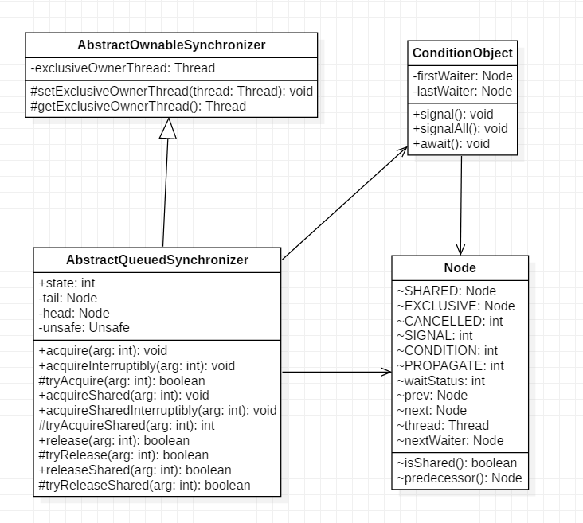

# 第6章 Java并发包中锁原理剖析

## LockSupport工具类

LockSupport是创建锁和其他同步类的基础。

LockSupport类与么个使用它的线程都会关联一个许可证，默认情况下调用LockSupport类的方法的线程是不持有许可证的。

下面介绍LockSupport类中的几个主要函数。

### 1. void park()

如果park方法拿到了与LockSupport关联的许可证，则调用LockSupport.park()时会马上返回，否则调用线程会被禁止参与线程的调度，也就是会被阻塞挂起。

如下代码直接在main函数里面调用park方法，最终只会输出 "begin park！"，然后当前线程被挂起，这时因为在默认情况下调用线程是不持有许可证的。

```java
public static void main(String[] args) {
    System.out.println("begin park!");
    LockSupport.park();
    System.out.println("end park!");
}
```
在其他线程调用unpark(Thread thread)方法并且将当前线程作为参数时，调用park方法而被阻塞的线程会返回。另外，如果其他线程调用了阻塞线程的interrupt()方法，设置了中断标志或者线程被虚假唤醒，则线程也会返回。所以在调用park方法时最好也使用循环条件判断方式。

> 注意：
> 因调用park方法而被阻塞的线程被其他线程中断而返回时并不会抛出InterruptedException异常。

### 2. void unpark(Thread thread)

当一个线程调用unpark时，如果参数thread线程没有持有thread与LockSupport类相关联的许可证，则让thread线程持有。如果thread因调用park()而被挂起，则unpark方法会使其被唤醒。如果thread之前没有调用park，则调用unpark方法后再调用park方法会立即返回，代码如下。

```java
public static void main(String[] args) {
    System.out.println("begin park!");
    LockSupport.unpark(Thread.currentThread());
    LockSupport.park();
    System.out.println("end park!");
}
```
输出如下：

    begin park!
    end park!


下面再来看一个例子来加深对park和unpark的理解。

```java
public static void main(String[] args) throws InterruptedException {
        Thread thread = new Thread(new Runnable() {
            @Override
            public void run() {
                System.out.println("child thread begin park!");
                // 挂起自己
                LockSupport.park();
                System.out.println("child thread unpark!");
            }
        });

        thread.start();

        // 确保调用unpark前子线程已经将自己挂起
        Thread.sleep(1000);

        System.out.println("main thread begin unpark!");

        LockSupport.unpark(thread);
    }
```

子线程将自己挂起，主线程中调用了unpark方法使得子线程得以继续运行。

### 3. void parkNanos(long nanos)

和park方法类似，如果调用park方法的线程已经拿到了与LockkSupport关联的许可证，则调用LockSupport.parkNanos(long nanos)方法会立即返回。不同之处在于，如果没有拿到许可证，则调用线程会被挂起nanos时间后自动返回。


## 抽象同步队列AQS概述

### AQS——锁的底层支持

AbstractQueuedSynchronizer抽象同步队列简称AQS，是实现同步器的基础组件。
    
以下为AQS的类结构图：



AQS是一个FIFO的双向队列，内部通过head和tail两个节点来对队列进行维护。

Node是AQS的一个静态内部类，属性SHARED和EXCLUSIVE分别代表用来标识线程是获取共享资源和独占资源时被阻塞挂起放入AQS队列的。thread为Node持有的Thread；waitStatus用于记录当前线程的状态，CANCELLED表示线程被取消，SIGNAL表示线程需要唤醒，CONDITION表示线程在条件队列里面等待，PROPAGATE表示释放共享资源时需要通知其他节点。

AQS维护了一个单一的状态信息state，可以通过getState、setState、产品，compareAndSetState函数修改其值。  

AQS内部类ConditionObject用来结合锁实现线程同步。

AQS实现线程同步的关键是对state进行操作，根据state是否属于一个线程，操作state的方式可分为独占方式和共享方式。

独占方式下获取和释放资源的方法为： 
> void acquire(int arg)
> void acauireInterruptibly(int arg)
> boolean release(int arg)

共享方式下获取和释放资源的方法为：
> void acauireShared(int arg)
> void acauireSharedInterruptibly(int arg)
> boolean releaseShared(int arg)

独占方式下，获取和释放资源的流程如下：

当一个线程调用acquire(int arg)获取独占资源时，会首先使用tryAcquire方法进行尝试，具体就是设置state的值，成功则世界返回，失败则将当前线程封装为类型为Node.EXCLUSIVE的Node节点后插入到AQS阻塞队列的尾部，并调用LockSupport.park(this)挂起自己。

```java
public final void acquire(int arg) {
    if (!tryAcquire(arg) &&
        acquireQueued(addWaiter(Node.EXCLUSIVE), arg))
        selfInterrupt();
}
```
但一个线程调用release(int arg)会尝试使用tryRelease操作释放资源，这里也是改变state的值，然后调用LockSupport.unpark(thread)方法激活AQS队列里面被阻塞的一个线程（thread）。悲剧或的线程使用tryAcquire尝试，看当前state的值是否满足自己的需要，满足则该线程被激活，继续向下运行，否则还是会被放入AQS队列并被挂起。

```java
public final boolean release(int arg) {
    if (tryRelease(arg)) {
        Node h = head;
        if (h != null && h.waitStatus != 0)
            unparkSuccessor(h);
        return true;
    }
    return false;
}
```
> 注意；
> AQS类并没有提供tryAcquire和tryRelease方法的实现，因为AQS是一个基础框架，这两个方法需要由子类自己实现来实现自己的特性。

共享方式下，获取和释放资源的流程如下；

当线程调用acquireShared(int arg)获取共享资源时，首先使用tryAcquireShared尝试获取资源并修改state，成功则直接放回，否则将当前线程封装为Node.SHARED类型的节点插入到AQS阻塞队列的尾部，并使用LockSupport.park(this)方法挂起自己。

```java
public final void acquireShared(int arg) {
    if (tryAcquireShared(arg) < 0)
        doAcquireShared(arg);
}
```

当一个线程调用releaseShared(int arg)时会尝试使用tryReleasedShared操作释放资源并修改state，然后使用LockSupport.unpark(thread)激活AQS队列中的一个线程（thread）。被激活的线程会调用tryReleaseShared查看当前state是否满足自己需求，满足则该线程被激活，否则继续挂起。

```java
    public final boolean releaseShared(int arg) {
        if (tryReleaseShared(arg)) {
            doReleaseShared();
            return true;
        }
        return false;
    }
```

> 注意：
> 同上，AQS没有提供tryAcquiredShared和tryReleaseShared方法的实现，这两个方法也需要由子类实现。

### AQS——条件变量的支持

以下是使用条件变量的例子：

```java
ReentrantLock lock = new ReentrantLock();
Condition condition = lock.newCondition();

lock.lock();
try{
    System.out.println("begin wait");
    condition.await();
    System.out.println("end wait");
} catch (InterruptedException e) {
    e.printStackTrace();
}finally {
    lock.unlock();
}

lock.lock();
try{
    System.out.println("begin signal");
    condition.signal();
    System.out.println("end signal");
}catch (Exception e){
    e.printStackTrace();
}finally {
    lock.unlock();
}
```
上述代码中，condition是由Lock对象调用newCondition方法创建的条件变量，一个Lock对象可以创建多个条件变量。

lock.lock()方法相当于进入synchronized同步代码块，用于获取独占锁；await()方法相当于Object.wait()方法，用于阻塞挂起当前线程，当其他线程调用了signal方法（相当于Object.notify()方法）时，被阻塞的线程才会从await处返回。

lock.newCondition()作用是new一个在AQS内部类ConditionObject对象。每个条件变量内部都维护了一个条件队列，用来存放调用该条件变量的await方法时被阻塞的线程。

> 注意：
> 这个条件队列和AQS队列不是一回事。

以下是await的源码：

```java
    public final void await() throws InterruptedException {
        if (Thread.interrupted())
            throw new InterruptedException();
        // 创建新的node节点，并插入到条件队列末尾    
        Node node = addConditionWaiter();
        // 释放当前线程的锁
        int savedState = fullyRelease(node);
        int interruptMode = 0;
        // 调用park方法阻塞挂起当前线程
        while (!isOnSyncQueue(node)) {
            LockSupport.park(this);
            if ((interruptMode = checkInterruptWhileWaiting(node)) != 0)
                break;
        }
        ...
    }
```
首先会构造一个类型为Node.CONDITION的node节点，ranhou将该节点处插入条件队列末尾，之后当前线程会释放获取的锁，并被阻塞挂起。这时如果有其他线程调用lock.lock()方法尝试获取锁，就会有一个线程获取到锁。

再来看signal源码：

```java
public final void signal() {
    if (!isHeldExclusively())
        throw new IllegalMonitorStateException();
    Node first = firstWaiter;
    if (first != null)
        // 将条件队列头元素移动到AQS队列等待执行
        doSignal(first);
}
```
调用signal时，会把条件队列队首元素放入AQS中并激活队首元素对应的线程。

