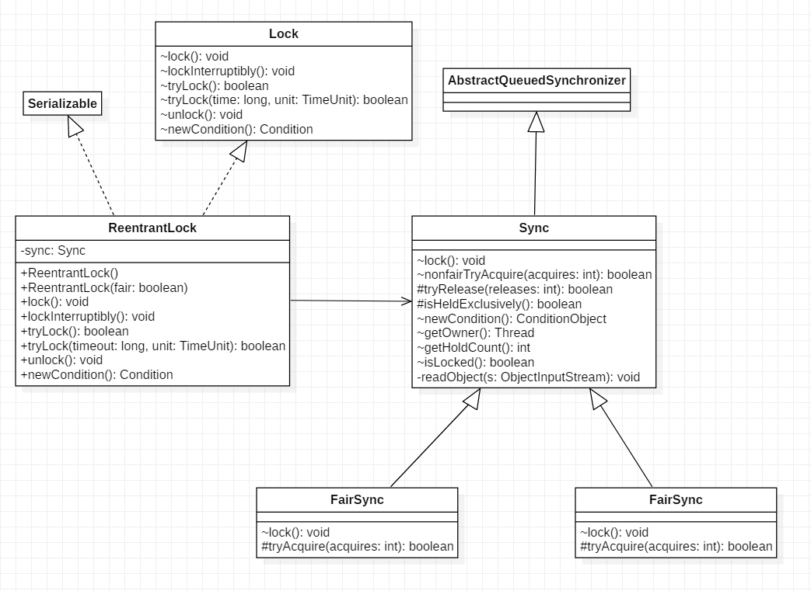

# 第6章 Java并发包中锁原理剖析

## LockSupport工具类

LockSupport是创建锁和其他同步类的基础。

LockSupport类与么个使用它的线程都会关联一个许可证，默认情况下调用LockSupport类的方法的线程是不持有许可证的。

下面介绍LockSupport类中的几个主要函数。

### 1. void park()

如果park方法拿到了与LockSupport关联的许可证，则调用LockSupport.park()时会马上返回，否则调用线程会被禁止参与线程的调度，也就是会被阻塞挂起。

如下代码直接在main函数里面调用park方法，最终只会输出 "begin park！"，然后当前线程被挂起，这时因为在默认情况下调用线程是不持有许可证的。

```java
public static void main(String[] args) {
    System.out.println("begin park!");
    LockSupport.park();
    System.out.println("end park!");
}
```
在其他线程调用unpark(Thread thread)方法并且将当前线程作为参数时，调用park方法而被阻塞的线程会返回。另外，如果其他线程调用了阻塞线程的interrupt()方法，设置了中断标志或者线程被虚假唤醒，则线程也会返回。所以在调用park方法时最好也使用循环条件判断方式。

> 注意：
> 因调用park方法而被阻塞的线程被其他线程中断而返回时并不会抛出InterruptedException异常。

### 2. void unpark(Thread thread)

当一个线程调用unpark时，如果参数thread线程没有持有thread与LockSupport类相关联的许可证，则让thread线程持有。如果thread因调用park()而被挂起，则unpark方法会使其被唤醒。如果thread之前没有调用park，则调用unpark方法后再调用park方法会立即返回，代码如下。

```java
public static void main(String[] args) {
    System.out.println("begin park!");
    LockSupport.unpark(Thread.currentThread());
    LockSupport.park();
    System.out.println("end park!");
}
```
输出如下：

    begin park!
    end park!


下面再来看一个例子来加深对park和unpark的理解。

```java
public static void main(String[] args) throws InterruptedException {
        Thread thread = new Thread(new Runnable() {
            @Override
            public void run() {
                System.out.println("child thread begin park!");
                // 挂起自己
                LockSupport.park();
                System.out.println("child thread unpark!");
            }
        });

        thread.start();

        // 确保调用unpark前子线程已经将自己挂起
        Thread.sleep(1000);

        System.out.println("main thread begin unpark!");

        LockSupport.unpark(thread);
    }
```

子线程将自己挂起，主线程中调用了unpark方法使得子线程得以继续运行。

### 3. void parkNanos(long nanos)

和park方法类似，如果调用park方法的线程已经拿到了与LockkSupport关联的许可证，则调用LockSupport.parkNanos(long nanos)方法会立即返回。不同之处在于，如果没有拿到许可证，则调用线程会被挂起nanos时间后自动返回。


## 抽象同步队列AQS概述

### AQS——锁的底层支持

AbstractQueuedSynchronizer抽象同步队列简称AQS，是实现同步器的基础组件。
    
以下为AQS的类结构图：


AQS是一个FIFO的双向队列，内部通过head和tail两个节点来对队列进行维护。

Node是AQS的一个静态内部类，属性SHARED和EXCLUSIVE分别代表用来标识线程是获取共享资源和独占资源时被阻塞挂起放入AQS队列的。thread为Node持有的Thread；waitStatus用于记录当前线程的状态，CANCELLED表示线程被取消，SIGNAL表示线程需要唤醒，CONDITION表示线程在条件队列里面等待，PROPAGATE表示释放共享资源时需要通知其他节点。

AQS维护了一个单一的状态信息state，可以通过getState、setState、产品，compareAndSetState函数修改其值。  

AQS内部类ConditionObject用来结合锁实现线程同步。

AQS实现线程同步的关键是对state进行操作，根据state是否属于一个线程，操作state的方式可分为独占方式和共享方式。

独占方式下获取和释放资源的方法为： 
> void acquire(int arg)
> void acauireInterruptibly(int arg)
> boolean release(int arg)

共享方式下获取和释放资源的方法为：
> void acauireShared(int arg)
> void acauireSharedInterruptibly(int arg)
> boolean releaseShared(int arg)

独占方式下，获取和释放资源的流程如下：

当一个线程调用acquire(int arg)获取独占资源时，会首先使用tryAcquire方法进行尝试，具体就是设置state的值，成功则世界返回，失败则将当前线程封装为类型为Node.EXCLUSIVE的Node节点后插入到AQS阻塞队列的尾部，并调用LockSupport.park(this)挂起自己。

```java
public final void acquire(int arg) {
    if (!tryAcquire(arg) &&
        acquireQueued(addWaiter(Node.EXCLUSIVE), arg))
        selfInterrupt();
}
```
但一个线程调用release(int arg)会尝试使用tryRelease操作释放资源，这里也是改变state的值，然后调用LockSupport.unpark(thread)方法激活AQS队列里面被阻塞的一个线程（thread）。悲剧或的线程使用tryAcquire尝试，看当前state的值是否满足自己的需要，满足则该线程被激活，继续向下运行，否则还是会被放入AQS队列并被挂起。

```java
public final boolean release(int arg) {
    if (tryRelease(arg)) {
        Node h = head;
        if (h != null && h.waitStatus != 0)
            unparkSuccessor(h);
        return true;
    }
    return false;
}
```
> 注意；
> AQS类并没有提供tryAcquire和tryRelease方法的实现，因为AQS是一个基础框架，这两个方法需要由子类自己实现来实现自己的特性。

共享方式下，获取和释放资源的流程如下；

当线程调用acquireShared(int arg)获取共享资源时，首先使用tryAcquireShared尝试获取资源并修改state，成功则直接放回，否则将当前线程封装为Node.SHARED类型的节点插入到AQS阻塞队列的尾部，并使用LockSupport.park(this)方法挂起自己。

```java
public final void acquireShared(int arg) {
    if (tryAcquireShared(arg) < 0)
        doAcquireShared(arg);
}
```

当一个线程调用releaseShared(int arg)时会尝试使用tryReleasedShared操作释放资源并修改state，然后使用LockSupport.unpark(thread)激活AQS队列中的一个线程（thread）。被激活的线程会调用tryReleaseShared查看当前state是否满足自己需求，满足则该线程被激活，否则继续挂起。

```java
    public final boolean releaseShared(int arg) {
        if (tryReleaseShared(arg)) {
            doReleaseShared();
            return true;
        }
        return false;
    }
```

> 注意：
> 同上，AQS没有提供tryAcquiredShared和tryReleaseShared方法的实现，这两个方法也需要由子类实现。

### AQS——条件变量的支持

以下是使用条件变量的例子：

```java
ReentrantLock lock = new ReentrantLock();
Condition condition = lock.newCondition();

lock.lock();
try{
    System.out.println("begin wait");
    condition.await();
    System.out.println("end wait");
} catch (InterruptedException e) {
    e.printStackTrace();
}finally {
    lock.unlock();
}

lock.lock();
try{
    System.out.println("begin signal");
    condition.signal();
    System.out.println("end signal");
}catch (Exception e){
    e.printStackTrace();
}finally {
    lock.unlock();
}
```
上述代码中，condition是由Lock对象调用newCondition方法创建的条件变量，一个Lock对象可以创建多个条件变量。

lock.lock()方法相当于进入synchronized同步代码块，用于获取独占锁；await()方法相当于Object.wait()方法，用于阻塞挂起当前线程，当其他线程调用了signal方法（相当于Object.notify()方法）时，被阻塞的线程才会从await处返回。

lock.newCondition()作用是new一个在AQS内部类ConditionObject对象。每个条件变量内部都维护了一个条件队列，用来存放调用该条件变量的await方法时被阻塞的线程。

> 注意：
> 这个条件队列和AQS队列不是一回事。

以下是await的源码：

```java
    public final void await() throws InterruptedException {
        if (Thread.interrupted())
            throw new InterruptedException();
        // 创建新的node节点，并插入到条件队列末尾    
        Node node = addConditionWaiter();
        // 释放当前线程的锁
        int savedState = fullyRelease(node);
        int interruptMode = 0;
        // 调用park方法阻塞挂起当前线程
        while (!isOnSyncQueue(node)) {
            LockSupport.park(this);
            if ((interruptMode = checkInterruptWhileWaiting(node)) != 0)
                break;
        }
        ...
    }
```
首先会构造一个类型为Node.CONDITION的node节点，ranhou将该节点处插入条件队列末尾，之后当前线程会释放获取的锁，并被阻塞挂起。这时如果有其他线程调用lock.lock()方法尝试获取锁，就会有一个线程获取到锁。

再来看signal源码：

```java
public final void signal() {
    if (!isHeldExclusively())
        throw new IllegalMonitorStateException();
    Node first = firstWaiter;
    if (first != null)
        // 将条件队列头元素移动到AQS队列等待执行
        doSignal(first);
}
```
调用signal时，会把条件队列队首元素放入AQS中并激活队首元素对应的线程。


### 基于AQS实现自定义同步器

下面基于AQS实现一个不可重入的独占锁。自定义AQS重写一系列函数，还需要定义原子变量state的含义。这里定义state为0表示目前锁灭有被线程持有，state为1表示锁已经被某一个线程持有。

```java
public class NonReentrantLock implements Lock, Serializable {

    // 内部帮助类
    private static class Sync extends AbstractQueuedSynchronizer {

        // 锁是否被持有
        @Override
        protected boolean isHeldExclusively() {
            return getState() == 1;
        }

        // 尝试获取锁
        @Override
        protected boolean tryAcquire(int arg) {
            if (compareAndSetState(0, 1)) {
                setExclusiveOwnerThread(Thread.currentThread());
                return true;
            }
            return false;
        }

        // 尝试释放锁
        @Override
        protected boolean tryRelease(int arg) {
            if(getState() == 0) {
                throw new IllegalMonitorStateException();
            }
            setExclusiveOwnerThread(null);
            setState(0);
            return true;
        }

        // 提供条件变量接口
        Condition newCondition() {
            return new ConditionObject();
        }

    }

    // 创建一个Sync来做具体工作
    private final Sync sync = new Sync();

    @Override
    public void lock() {
        sync.acquire(1);
    }


    @Override
    public boolean tryLock() {
        return sync.tryAcquire(1);
    }

    @Override
    public boolean tryLock(long time, TimeUnit unit) throws InterruptedException {
        return sync.tryAcquireNanos(1, unit.toNanos(time));
    }


    @Override
    public void unlock() {
        sync.tryRelease(1);
    }


    @Override
    public void lockInterruptibly() throws InterruptedException {
        sync.acquireInterruptibly(1);
    }


    @Override
    public Condition newCondition() {
        return sync.newCondition();
    }
}
```

NonReentrantLock定义了一个内部类Sync用来实现具体的锁的操作，Sync继承了AQS。由于是独占锁，：Sync只重写了tryAcquire、tryRelease、isHeldExclusively。此外，Sync提供了newCondition方法来支持条件变量。

下面使用自定义的锁来实现简单的生产-消费模型

```java
final static NonReentrantLock lock = new NonReentrantLock();
final static Condition notFull = lock.newCondition();
final static Condition notEmpty = lock.newCondition();

final static Queue<String> queue = new LinkedBlockingQueue<>();
final static int queueSize = 10;

public static void main(String[] args) {
    Thread producer = new Thread(new Runnable() {
        @Override
        public void run() {
            // 获取独占锁
            lock.lock();
            try {
                while (true) {
                    // 队列满了则等待
                    while (queue.size() >= queueSize) {
                        notEmpty.await();
                    }
                    queue.add("ele");
                    System.out.println("add...");
                    notFull.signalAll();
                }
            } catch (InterruptedException e) {
                e.printStackTrace();
            } finally {
                // 释放锁
                lock.unlock();
            }
        }
    });

    Thread consumer = new Thread(new Runnable() {
        @Override
        public void run() {
            // 获取独占锁
            lock.lock();
            try {
                while (true) {
                    // 队列空则等待
                    while (queue.size() == 0) {
                        notFull.await();
                    }
                    String ele = queue.poll();
                    System.out.println("poll...");
                    notEmpty.signalAll();
                }
            } catch (InterruptedException e) {
                e.printStackTrace();
            } finally {
                // 释放锁
                lock.unlock();
            }
        }
    });

    producer.start();
    consumer.start();
}
```

代码使用了NonReentrantLock来创建lock，并调用lock.newCondition创建了两个条件变量用来实现生产者和消费者线程的同步。

## ReentrantLock的原理

### 类图结构



构造函数如下：

```java
public ReentrantLock() {
    sync = new NonfairSync();
}

public ReentrantLock(boolean fair) {
    sync = fair ? new FairSync() : new NonfairSync();
}
```

可以看到，ReentrantLock最终还是依赖AQS，并且根据传入的参数来决定其内部是一个公平锁还是非公平锁（默认为公平锁）。

Sync类直接继承自AQS，它的子类NonfairSync和FairSync分别实现了获取锁的非公平与公平策略。

AQS的state表示线程获取锁的可重入次数。state为0表示当前锁没有被任何线程持有。当一个线程第一次获取该所是会尝试使用CAS设置state为1，成功后记录该锁的持有者为当前线程。以后每一次加锁state就增加1，表示可重入次数。当该线程释放该锁时，state减1，如果减1后state为0，则当前线程释放该锁。

### 获取锁

#### void lock()

当一个线程调用该方法时，如果锁当前没有被其他线程占有并且当前线程之前没有获取过该锁，则当前线程会获取到该锁，然后设置当前锁的拥有者为当前线程，并且将state置为1；如果当前线程已经获取过该锁，则将state的值增加1；如果该锁已经被其他线程持有，则调用该方法的线程会被放入AQS队列中阻塞挂起等待，

```java
public void lock() {
    sync.lock();
}
```

ReentrantLock的lock()委托给了sync，根据创建ReentrantLock构造函数选择sync的实现时NonfairSync还是FairSync，这个锁是一个公平锁或者非公平锁。

先来看非公平锁的情况：

```java
final void lock() {
    // CAS设置state为1
    if (compareAndSetState(0, 1))
        setExclusiveOwnerThread(Thread.currentThread());
    else
        // 调用AQS的acquire方法
        acquire(1);
}
```

默认state为0，所以第一个调用Lock的吸纳成会通过CAS设置状态值为1，CAS成功则表示当前线程获取到了锁，然后设置该锁持有者为当前线程。

如果此时有其他线程企图过去该锁，CAS会失败，然后会调用AQS的acquire方法。

再贴下acquire的源码：

```java
public final void acquire(int arg) {
    if (!tryAcquire(arg) &&
        acquireQueued(addWaiter(Node.EXCLUSIVE), arg))
        selfInterrupt();
}
```

之前说过，AQS并没有提供可用的tryAcquire方法，tryAcquire方法需要子类自己定制。这里会调用ReentrantLock重写的tryAcquire方法。下面先看非公平锁的代码。

```java
protected final boolean tryAcquire(int acquires) {
    return nonfairTryAcquire(acquires);
}

final boolean nonfairTryAcquire(int acquires) {
    final Thread current = Thread.currentThread();
    int c = getState();
    // （1）锁未被持有
    if (c == 0) {
        if (compareAndSetState(0, acquires)) {
            // 设置锁的持有者为当前线程
            setExclusiveOwnerThread(current);
            return true;
        }
    }
    // （2）锁已经被某个线程持有，如果该线程为当前线程
    else if (current == getExclusiveOwnerThread()) {
        int nextc = c + acquires;
        if (nextc < 0) // overflow
            throw new Error("Maximum lock count exceeded");
            // 增加重入数
        setState(nextc);
        return true;
    }
    return false;
}
```

源码比较简单，分析见注释。

下面来看非公平性体现在哪儿。首先非公平指的是先尝试获取锁的线程并不一定首先获取该锁。

假设线程A执行到代码（1）发现线程已经被持有然后执行到（2）发现当前线程不是锁持有者，则返回false被放入AQS中进行等待。假设这时线程B也执行到了代码（1），发现state为0（假设占有该锁的其他线程释放了该锁）， 就成功获取了锁，而比B先请求锁的线程A还在等待，这就是非公平性的体现。

下面看FairSync重写的tryAcquire方法。

```java
protected final boolean tryAcquire(int acquires) {
    final Thread current = Thread.currentThread();
    int c = getState();
    if (c == 0) {
        // 公平性策略
        if (!hasQueuedPredecessors() &&
            compareAndSetState(0, acquires)) {
            setExclusiveOwnerThread(current);
            return true;
        }
    }
    else if (current == getExclusiveOwnerThread()) {
        int nextc = c + acquires;
        if (nextc < 0)
            throw new Error("Maximum lock count exceeded");
        setState(nextc);
        return true;
    }
    return false;
}
```

由代码可知，公平的tryAcquire方法与非公平的区别在于增加了一个hasQueuedPredecessors方法来判断是否有线程在当前线程前尝试获取锁。

下面是hasQueuedPredecessors的具体实现。

```java
public final boolean hasQueuedPredecessors() {
    Node t = tail; // Read fields in reverse initialization order
    Node h = head;
    Node s;
    return h != t &&
        ((s = h.next) == null || s.thread != Thread.currentThread());
}
```

如果当前线程节点有前驱节点则返回true，否则如果当前AQS队列为空或者当前线程节点是AQS的第一个节点则返回false。其中h==t说明当前队列为空，直接返回false；如果h!=t并且s==null说明有一个元素将要作为AQS的第一个节点入队（AQS入队包含两步操作：首先创建一个哨兵头节点，然后将第一个元素插入哨兵节点后面），那么返回true；如果h!=t并且s!=null且s.thread!=Thread.currentThread()说明队列里面的第一个元素不是当前线程，那么返回true。

#### void lockInterruptibly

与lock()方法类似，不同之处在于，它对中断进行相应，就是当前线程在调用该方法时，如果其他线程调用了当前线程的interrupt方法，则当前线程会抛出inetrruptedException
异常，然后返回。

```java
public void lockInterruptibly() throws InterruptedException {
    sync.acquireInterruptibly(1);
}

public final void acquireInterruptibly(int arg)
        throws InterruptedException {
    // 如果当前线程被中断，则直接抛出异常并返回
    if (Thread.interrupted())
        throw new InterruptedException();
    if (!tryAcquire(arg))
        doAcquireInterruptibly(arg);
}
```

#### boolean tryLock()

尝试获取锁，如果当前该锁没有被其他线程持有，则当前线程获取该锁并返回true，否则返回false。该方法不会引起当前线程阻塞。

```java
public boolean tryLock() {
    return sync.nonfairTryAcquire(1);
}

final boolean nonfairTryAcquire(int acquires) {
    final Thread current = Thread.currentThread();
    int c = getState();
    if (c == 0) {
        // 非公平策略
        if (compareAndSetState(0, acquires)) {
            setExclusiveOwnerThread(current);
            return true;
        }
    }
    else if (current == getExclusiveOwnerThread()) {
        int nextc = c + acquires;
        if (nextc < 0) // overflow
            throw new Error("Maximum lock count exceeded");
        setState(nextc);
        return true;
    }
    return false;
}
```

上述代码与非公平锁的tryAcquire方法类似，所以tryLock使用的是非公平策略。

#### boolean tryLock(long timeout, TimeUnit unit)

```java
public boolean tryLock(long timeout, TimeUnit unit)
        throws InterruptedException {
    return sync.tryAcquireNanos(1, unit.toNanos(timeout));
}
```    

设置了超时时间，如果超时时间到了还没有获取到该锁则返回false。


### 释放锁

#### void unlock()

尝试释放锁，如果当前线程持有该锁，则调用该方法会让该线程对该线程持有的AQS状态值减1，如果减去1后状态值为0，则当前线程会释放该锁。

```java
public void unlock() {
    sync.release(1);
}

protected final boolean tryRelease(int releases) {
    int c = getState() - releases;
    // 如果当前线程不是该锁持有者直接抛出异常
    if (Thread.currentThread() != getExclusiveOwnerThread())
        throw new IllegalMonitorStateException();
    boolean free = false;
    // 若state变为0，则清空锁持有线程
    if (c == 0) {
        free = true;
        setExclusiveOwnerThread(null);
    }
    // 设置可重入次数减1
    setState(c);
    return free;
}
```


