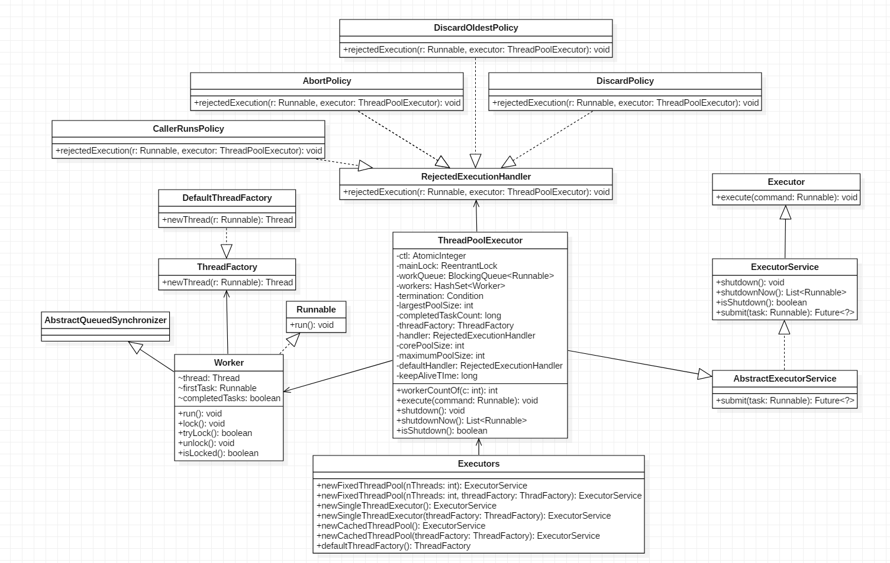

# 第8章 Java并发包中线程池ThreadPoolExecutor原理探究

## 目录

- [类图结构](#类图结构)
- [源码分析](#源码分析)
    - [void execute(Runnable command)](#void-executerunnable-command)
    - [Worker的执行](#worker的执行)
    - [void shutdown()](#void-shutdown)
    - [List&lt;Runnable&gt; shutdownNow()](#listltrunnablegt-shutdownnow)
    - [boolean awaitTermination(long timeout, TimeUnit unit)](#boolean-awaitterminationlong-timeout-timeunit-unit)
- [更多](#更多)

## 类图结构



如图所示，Executors是个工具类，用来提供不同特性的线程池。ThreadPoolExecutor中的ctl是一个原子变量，用来记录线程池状态和线程池中的线程个数，类似于ReentrantReadWriteLock中使用一个变量来保存两种信息。

以下为与ctl相关的变量与函数：

```java
private final AtomicInteger ctl = new AtomicInteger(ctlOf(RUNNING, 0));
// 假设Integer为32位（不同平台下可能不同），则前3位用来表示线程运行状态，
// 后29位用来表示线程个数
private static final int COUNT_BITS = Integer.SIZE - 3;
// 00011111111111111111111111111111
private static final int CAPACITY   = (1 << COUNT_BITS) - 1;

// 11100000000000000000000000000000
private static final int RUNNING    = -1 << COUNT_BITS;
// 00000000000000000000000000000000
private static final int SHUTDOWN   =  0 << COUNT_BITS;
// 00100000000000000000000000000000
private static final int STOP       =  1 << COUNT_BITS;
// 01000000000000000000000000000000
private static final int TIDYING    =  2 << COUNT_BITS;
// 01100000000000000000000000000000
private static final int TERMINATED =  3 << COUNT_BITS;

// 取高3位的值
private static int runStateOf(int c)     { return c & ~CAPACITY; }
// 低29位的值
private static int workerCountOf(int c)  { return c & CAPACITY; }
// 通过指定的rs（Running State）和wc（Workers Count）生成新的ctl状态值
private static int ctlOf(int rs, int wc) { return rs | wc; }
```

线程池的状态含义如下：

- RUNNING：接受新任务并处理阻塞队列里的任务。
- SHUTDOWN：拒绝新任务但是处理阻塞队列里面的任务。
- STOP：拒绝新任务并且抛弃阻塞队列里的任务，同时会中断正在处理的任务。
- TIDYING：所有任务都执行完后当前线程池活动线程数为0，将要调用terminated方法（相当于一个过渡状态）。
- TERMINATED： 终止状态，terminated方法调用完成后的状态。

线程池参数如下：

- corePoolSize：核心线程池，通常情况下最多添加corePoolSize个Worker，当任务过多时（阻塞队列满了），会继续添加Worker直到Worker数达到maximumPoolSize
- workQueue：用于保存等待执行的任务的阻塞队列。
- maximumPoolSize：线程池最大线程数量（能添加的Worker的最大数量）
- ThreadFactory：创建线程的工厂
- RejectedExecutionHandler：饱和策略，当队列满并且线程个数达到maximumPoolSize后采取的策略。
- keepAliveTime: 存活时间。如果当前线程池中的线程数量比核心线程数量多，并且是闲置状态，则为这些闲置的线程能存活的最大时间。

mainLock是独占锁，用来控制新增Worker线程操作的原子性。termination是该锁对应的条件队列。

Worker继承AQS并实现了Runnable接口，是具体承载任务的而对象。Worker继承了AQS，自己实现了简单不可重入独占锁，其中state=0表示锁未被获取，state=1表示锁已经被获取，state=-1是常见Worker的默认状态，是为了避免该线程在运行runWorker方法前被中断。
  
以下是对Executors中创建线程池的方法的介绍。

- newFixedThreadPool

```java
public static ExecutorService newFixedThreadPool(int nThreads, ThreadFactory threadFactory) {
    return new ThreadPoolExecutor(nThreads, nThreads,
                                    0L, TimeUnit.MILLISECONDS,
                                    new LinkedBlockingQueue<Runnable>(),
                                    threadFactory);
}                                    

```

创建一个核心线程数和做大线程数都是nThreads的线程池，并且阻塞队列长度为Integer.MAX_VALUE。keepAliveTime=0说明只要线程个数比核心线程个数多并且当前空闲则回收。

- newSingleThreadExecutor

```java
public static ExecutorService newSingleThreadExecutor() {
    return new FinalizableDelegatedExecutorService
        (new ThreadPoolExecutor(1, 1,
                                0L, TimeUnit.MILLISECONDS,
                                new LinkedBlockingQueue<Runnable>()));
}
```

创建一个核心线程个数和最大线程个数都是1的线程池。

- newCachedThreadPool
  
```java
public static ExecutorService newCachedThreadPool() {
    return new ThreadPoolExecutor(0, Integer.MAX_VALUE,
                                    60L, TimeUnit.SECONDS,
                                    new SynchronousQueue<Runnable>());
}
```
创建一个按需创建线程的线程池，初始线程个数为0，最多线程个数为Integer.MAX_VALUE。KeepAliveTime=60说明只要当前线程在60s内空闲就会被回收。这个类型的特殊之处在于，加入同步队列的任务会被马上执行，同步队列里面最多只有一个任务。

## 源码分析

ThreadPoolExecutor的实现实际是一个生产-消费模型，当用户添加任务到线程池时相当于生产者生产元素，workers中的线程直接执行任务或者从任务队列里面获取任务（当没有空闲的Worker时，任务会被暂存于任务队列中）时相当于消费者消费元素。

### void execute(Runnable command)

```java
// 执行任务
public void execute(Runnable command) {
    if (command == null)
        throw new NullPointerException();
    // 获取线程池状态
    int c = ctl.get();
    // 如果Worker个数小于核心线程数则新增一个Worker
    if (workerCountOf(c) < corePoolSize) {
        // 添加Worker，第二个参数为true表示新增Worker为核心线程
        if (addWorker(command, true))
            return;
        // 重新获取ctl，多线程下ctl变化比较频繁，要确保所获取的状态是最新的    
        c = ctl.get();
    }
    // 线程池关闭后没有接受任务的必要
    // 如果线程池还在运行，尝试将任务加入工作队列
    if (isRunning(c) && workQueue.offer(command)) {
        int recheck = ctl.get();
        // 可能任务入队后线程池又关闭了，则直接移除该任务
        if (! isRunning(recheck) && remove(command))
            reject(command);
        // 在该任务成功入队前，可能所有Worker都因为keepAliveTime到达而被回收，
        // 这时需要重新创建一个Worker来处理任务队列里面的任务    
        else if (workerCountOf(recheck) == 0)
            addWorker(null, false);
    }
    // 如果任务队列满了，则尝试增加一个非核心线程来处理任务，
    // 失败则执行拒绝策略
    else if (!addWorker(command, false))
        reject(command);
}

// 添加一个Worker
private boolean addWorker(Runnable firstTask, boolean core) {

    // 此循环用于增加Worker个数
    retry:
    for (;;) {
        int c = ctl.get();
        int rs = runStateOf(c);

        // 当线程池状态为SHUTDOWN、STOP、TIDYING或TERMINATED时将不再增加Worker来处理任务，
        // 但要排除线程池状态刚转为SHUTDOWN且
        // （（设置了Worker过期时间且所有Worker均被回收）或（未设置Worker过期时间且Worker个数小于corePoolSize））
        // 但任务队列还有任务的情况。
        // 因为由SHUTDOWN状态的定义可知线程池会拒绝新任务但会处理任务队列里面剩余任务。
        // firstTask==null表示此次调用addWorker方法并不是要直接给新创建的Worker分配一个任务，
        // 而是要让它从任务队列中取尝试获取一个任务。
        // 在所有Worker都被回收且任务队列非空的情况下，
        // 自然要新增Worker来处理任务队列中剩余的任务；
        // 在未设置Worker过期时间且Worker数小于corePoolSize的情况下，
        // 仍需要添加一个Worker来提高处理剩余任务的效率。
        if (rs >= SHUTDOWN &&
            ! (rs == SHUTDOWN &&
                firstTask == null &&
                ! workQueue.isEmpty()))
            return false;

        for (;;) {
            int wc = workerCountOf(c);
            // Worker数量检测
            if (wc >= CAPACITY ||
                wc >= (core ? corePoolSize : maximumPoolSize))
                return false;
            // 成功增加了Worker个数，直接跳出外层for循环执行实际添加Worker的代码    
            if (compareAndIncrementWorkerCount(c))
                break retry;
            c = ctl.get();
            // 状态改变则跳出内层循环，再次执行外循环进行新的状态判断
            // 否则继续在内层循环自旋直到CAS操作成功
            if (runStateOf(c) != rs)
                continue retry;
        }
    }

    // 执行到此处说明已通过CAS操作成功增减了Worker个数
    // 以下代码用于实际增加Worker
    boolean workerStarted = false;
    boolean workerAdded = false;
    Worker w = null;
    try {
        w = new Worker(firstTask);
        final Thread t = w.thread;
        if (t != null) {
            final ReentrantLock mainLock = this.mainLock;
            // 加独占锁是为了实现workers同步，因为可能多个线程调用了线程池的execute方法
            mainLock.lock();
            try {
                // 重新获取线程池状态，因为有可能在获取锁之前执行了shutdown操作
                int rs = runStateOf(ctl.get());
                // 如果线程池还在运行或（线程池处于SHUTDOWN状态并且firstTast为null），执行添加Worker操作
                if (rs < SHUTDOWN ||
                    (rs == SHUTDOWN && firstTask == null)) {
                    if (t.isAlive())
                        throw new IllegalThreadStateException();
                    // 将新创建的Worker添加到workers队列     
                    workers.add(w);
                    int s = workers.size();
                    // 更新线程池工作线程最大数量
                    if (s > largestPoolSize)
                        largestPoolSize = s;
                    workerAdded = true;
                }
            } finally {
                mainLock.unlock();
            }
            if (workerAdded) {
                // 添加成功则启动工作线程
                t.start();
                workerStarted = true;
            }
        }
    } finally {
        if (! workerStarted)
            addWorkerFailed(w);
    }
    return workerStarted;
}
```

### Worker的执行

任务提交到线程池后由Worker来执行。

```java
Worker(Runnable firstTask) {
    // 调用runWorker前禁止中断
    setState(-1);
    this.firstTask = firstTask;
    this.thread = getThreadFactory().newThread(this);
}

final void runWorker(Worker w) {
    Thread wt = Thread.currentThread();
    Runnable task = w.firstTask;
    w.firstTask = null;
    w.unlock(); // 将state置为0，允许中断
    boolean completedAbruptly = true;
    try {
        // 执行传入的任务或任务队列中的任务
        // getTask用于从任务队列中获取任务，可能会被阻塞
        while (task != null || (task = getTask()) != null) {
            w.lock();
            ...
            try {
                // 空方法，用于子类继承重写
                beforeExecute(wt, task);
                Throwable thrown = null;
                try {
                    // 执行任务
                    task.run();
                } catch (RuntimeException x) {
                    thrown = x; throw x;
                } catch (Error x) {
                    thrown = x; throw x;
                } catch (Throwable x) {
                    thrown = x; throw new Error(x);
                } finally {
                    // 空方法，用于子类继承重写
                    afterExecute(task, thrown);
                }
            } finally {
                task = null;
                // 添加任务完成数量
                w.completedTasks++;
                w.unlock();
            }
        }
        completedAbruptly = false;
    } finally {
        // Worker被回收前执行清理工作
        processWorkerExit(w, completedAbruptly);
    }
}
```

在构造函数中设置Worker的状态为-1是为了避免当前Worker在调用runWorker方法前被中断（当其他线程调用了shutdownNow方法，如果Worker状态>=0则会中断该线程）。

runWorker中调用unlock方法时将state置为0，使Worker线程可被中断。

processWorkerExit方法如下。

```java
private void processWorkerExit(Worker w, boolean completedAbruptly) {
    // 如果runWorker方法非正常退出，则将workerCount递减
    if (completedAbruptly)
        decrementWorkerCount();

    final ReentrantLock mainLock = this.mainLock;
    mainLock.lock();
    try {
        // 记录任务完成个数
        completedTaskCount += w.completedTasks;
        workers.remove(w);
    } finally {
        mainLock.unlock();
    }

    // 尝试设置线程池状态为TERMINATED，如果当前是SHUTDOWN状态并且任务队列为空
    // 或当前是STOP状态，当前线程池里没有活动线程
    tryTerminate();

    int c = ctl.get();
    if (runStateLessThan(c, STOP)) {
        if (!completedAbruptly) {

            // 在设置了Worker过期时间的情况下，如果任务队列为空，不必新增Worker，
            // 如果不为空，当存在Worker时不必新增Worker。
            // 在没有设置过期时间的情况下，仅当线程个数小于核心线程数时增加Worker。
            // 由此可知，在不主动关闭线程池的情况下，
            // 将会一直有Worker存在来接受任务。
            int min = allowCoreThreadTimeOut ? 0 : corePoolSize;
            if (min == 0 && ! workQueue.isEmpty())
                min = 1;
            if (workerCountOf(c) >= min)
                return; // 将不执行addWorker操作
        }
        addWorker(null, false);
    }
}
```

### void shutdown()

调用shutdown后，线程池将不再接受新任务，但任务队列中的任务还是要执行的。

```java
public void shutdown() {
    final ReentrantLock mainLock = this.mainLock;
    mainLock.lock();
    try {
        // 检查是否有关闭线程池的权限
        checkShutdownAccess();
        // 设置当前线程池状态为SHUTDOWN，如果已经是SHUTDOWN则直接返回
        advanceRunState(SHUTDOWN);
        // 中断空闲的Worker
        interruptIdleWorkers();
        onShutdown(); // hook for ScheduledThreadPoolExecutor
    } finally {
        mainLock.unlock();
    }
    // 尝试将状态转为TERMINATED
    tryTerminate();
}

private static final RuntimePermission shutdownPerm = new RuntimePermission("modifyThread");

/**
 * 检查是否设置了安全管理器，是则看当前调用shutdown命令的线程是否具有关闭线程的权限，
 * 如果有还要看调用线程是否有中断工作线程的权限，
 * 如果没有权限则抛出异常
 */
private void checkShutdownAccess() {
    SecurityManager security = System.getSecurityManager();
    if (security != null) {
        security.checkPermission(shutdownPerm);
        final ReentrantLock mainLock = this.mainLock;
        mainLock.lock();
        try {
            for (Worker w : workers)
                security.checkAccess(w.thread);
        } finally {
            mainLock.unlock();
        }
    }
}

// ez
private void advanceRunState(int targetState) {
    for (;;) {
        int c = ctl.get();
        if (runStateAtLeast(c, targetState) ||
            ctl.compareAndSet(c, ctlOf(targetState, workerCountOf(c))))
            break;
    }
}

// 设置所有空闲线程的中断标志
private void interruptIdleWorkers() {
    interruptIdleWorkers(false);
}

private void interruptIdleWorkers(boolean onlyOne) {
    final ReentrantLock mainLock = this.mainLock;
    mainLock.lock();
    try {
        for (Worker w : workers) {
            Thread t = w.thread;
            // 只中断那些还没被中断的
            // 获取w的锁成功说明w在执行runWorker方法调用getTask时被阻塞，
            // 也就是说w是空闲的，那就中断它
            if (!t.isInterrupted() && w.tryLock()) {
                try {
                    t.interrupt();
                } catch (SecurityException ignore) {
                } finally {
                    w.unlock();
                }
            }
            // 如果只中断一个则退出循环
            if (onlyOne)
                break;
        }
    } finally {
        mainLock.unlock();
    }
}

final void tryTerminate() {
    for (;;) {
        int c = ctl.get();
        // 判断是否满足可终止条件
        // 线程池处于RUNNING状态
        // 或处于TIDYING状态（说明有其他线程调用了tryTerminate方法且即将成功终止线程池）
        // 或线程池正处于SHUTDOWN状态且任务队列不为空时不可终止
        if (isRunning(c) ||
            runStateAtLeast(c, TIDYING) ||
            (runStateOf(c) == SHUTDOWN && ! workQueue.isEmpty()))
            return;
        // 还有Worker的话，中断一个空闲Worker后返回   
        // 正在执行任务的Worker会在执行完任务后调用tryTerminate方法 
        if (workerCountOf(c) != 0) { 
            interruptIdleWorkers(ONLY_ONE);
            return;
        }

        final ReentrantLock mainLock = this.mainLock;
        mainLock.lock();
        try {
            // 设置线程池状态为TIDYING
            if (ctl.compareAndSet(c, ctlOf(TIDYING, 0))) {
                try {
                    // 空方法，由子类继承重写，进行线程池关闭时的清理工作
                    terminated();
                } finally {
                    // 此处无需使用CAS，因为即使CAS失败也说明线程池终止了
                    ctl.set(ctlOf(TERMINATED, 0));
                    // 激活因调用条件变量termination的await系列方法而被阻塞的所有线程
                    termination.signalAll();
                }
                return;
            }
        } finally {
            mainLock.unlock();
        }
        // else retry on failed CAS
    }
}
```

### List&lt;Runnable&gt; shutdownNow()

调用shutdownNow后，线程池将不会再接受新任务，并且会丢弃任务队列里面的任务且中断正在执行的任务，然后立刻返回任务队列里面的任务列表。

```java
public List<Runnable> shutdownNow() {
    List<Runnable> tasks;
    final ReentrantLock mainLock = this.mainLock;
    mainLock.lock();
    try {
        checkShutdownAccess();
        advanceRunState(STOP);
        // 不是interruptIdleWorkers()
        // 中断所有在运行的Worker
        interruptWorkers();
        // 将任务队列中的任务移动到tasks中
        tasks = drainQueue();
    } finally {
        mainLock.unlock();
    }
    tryTerminate();
    return tasks;
}

// 中断所有在运行的Worker
private void interruptWorkers() {
    final ReentrantLock mainLock = this.mainLock;
    mainLock.lock();
    try {
        for (Worker w : workers)
            w.interruptIfStarted();
    } finally {
        mainLock.unlock();
    }
}
```

### boolean awaitTermination(long timeout, TimeUnit unit)

当线程调用awaitTermination后，当前线程会被阻塞，直到线程池状态变成TERMINATIED或等待超时才返回。

```java
public boolean awaitTermination(long timeout, TimeUnit unit)
    throws InterruptedException {
    long nanos = unit.toNanos(timeout);
    final ReentrantLock mainLock = this.mainLock;
    mainLock.lock();
    try {
        for (;;) {
            // 如果线程池已经终止，则直接返回
            if (runStateAtLeast(ctl.get(), TERMINATED))
                return true;
            if (nanos <= 0)
                return false;
            // 等待相应时间，线程池成功关闭后会调用termination.signalAll()将当前线程激活
            nanos = termination.awaitNanos(nanos);
        }
    } finally {
        mainLock.unlock();
    }
}
```

## 更多

相关笔记：[《Java并发编程之美》阅读笔记](/README.md)
