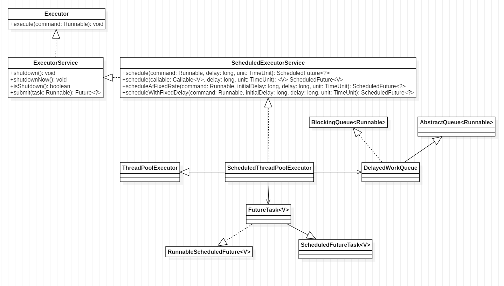

# 第9章 Java并发包中ScheduledThreadPoolExecutor原理探究

## 目录

- [类图结构](#类图结构)
- [源码分析](#源码分析)
    - [schedule(Runnable command, long delay, TimeUnit unit)](#schedulerunnable-command-long-delay-timeunit-unit)
    - [scheduleWithFixedDelay(Runnable command,　long initialDelay,　long delay,　TimeUnit unit)](#schedulewithfixeddelayrunnable-command　long-initialdelay　long-delay　timeunit-unit)
    - [scheduleAtFixedRate(Runnable command, long initialDelay, long period, TimeUnit unit)](#scheduleatfixedraterunnable-command-long-initialdelay-long-period-timeunit-unit)
- [更多](#更多)

## 类图结构

ScheduledThreadPoolExecutor时一个可以在指定一定延迟时间后或者定时进行任务调度执行的线程池。



ScheduledThreadPoolExecutor继承了ThreadPoolExecutor并实现了ScheduledExecutorService接口。

线程池队列是DelayedWorkQueue，与DelayedQueue一样属于延迟队列。

ScheduledFuturetask是具有返回值的任务，继承自FutureTask。FutureTask内部用一个变量state来表示任务的状态，一开始为NEW。

各状态意义如下：

    private static final int NEW          = 0; // 初始状态
    private static final int COMPLETING   = 1; // 执行中
    private static final int NORMAL       = 2; // 正常运行结束
    private static final int EXCEPTIONAL  = 3; // 运行中异常
    private static final int CANCELLED    = 4; // 任务被取消
    private static final int INTERRUPTING = 5; // 任务正在被中断
    private static final int INTERRUPTED  = 6; // 任务已经被中断

ScheduledFutureTask内部用一个变量period来表示任务的类型：

- period=0，说明当前任务是一次性的，执行完毕后就推出了。
- period为负数，说明当前任务为固定延迟的定时可重复执行任务（执行完一次后会停止指定时间后再次运行，若每次执行任务耗时不同，则显然相邻两次任务执行间隔不同）。
- period为正数，说明当前任务为固定频率的定尺可重复执行任务（也即固定周期）。

以下为ScheduledThreadPoolExecutor的构造函数：

```java
public ScheduledThreadPoolExecutor(int corePoolSize) {
    super(corePoolSize, Integer.MAX_VALUE, 0, NANOSECONDS,
            new DelayedWorkQueue());
}

// 指定了线程工厂
public ScheduledThreadPoolExecutor(int corePoolSize,
                                    ThreadFactory threadFactory) {
    super(corePoolSize, Integer.MAX_VALUE, 0, NANOSECONDS,
            new DelayedWorkQueue(), threadFactory);
}

// 指定了拒绝策略
public ScheduledThreadPoolExecutor(int corePoolSize,
                                    RejectedExecutionHandler handler) {
    super(corePoolSize, Integer.MAX_VALUE, 0, NANOSECONDS,
            new DelayedWorkQueue(), handler);
}

// 指定了线程工厂和拒绝策略
public ScheduledThreadPoolExecutor(int corePoolSize,
                                    ThreadFactory threadFactory,
                                    RejectedExecutionHandler handler) {
    super(corePoolSize, Integer.MAX_VALUE, 0, NANOSECONDS,
            new DelayedWorkQueue(), threadFactory, handler);
}        
```

从上面的代码中可以看到，ScheduledThreadPoolExecutor的线程池队列为DelayedWorkQueue。

## 源码分析

### schedule(Runnable command, long delay, TimeUnit unit)

提交一个延迟执行的任务，任务从提交时间算起延迟单位为unit的delay后开始执行。提交的任务不是周期性任务，任务只会执行一次。

```java
public ScheduledFuture<?> schedule(Runnable command, long delay, TimeUnit unit) {
    // 参数校验
    if (command == null || unit == null)
        throw new NullPointerException();
    // 将任务包装成ScheduledFutureTask
    // triggerTime方法用来计算触发时间（即任务开始执行的绝对时间）
    RunnableScheduledFuture<?> t = decorateTask(command,
        new ScheduledFutureTask<Void>(command, null, triggerTime(delay, unit)));
    // 添加任务到延迟队列
    delayedExecute(t);
    return t;
}
```

以下是ScheduledFutureTask的相关代码：

```java
ScheduledFutureTask(Runnable r, V result, long ns) {
    // 调用父类构造函数
    super(r, result);
    this.time = ns; // 等待ns纳秒后开始执行
    this.period = 0; // period=0说明为一次性任务
    // 记录任务编号
    this.sequenceNumber = sequencer.getAndIncrement(); 
}

public FutureTask(Runnable runnable, V result) {
    // 将Runnable任务转化成Callable任务
    this.callable = Executors.callable(runnable, result);
    this.state = NEW;       // ensure visibility of callable
}
```

delayedExecute的代码如下：

```java
private void delayedExecute(RunnableScheduledFuture<?> task) {
    //  线程池关闭则执行拒绝策略
    if (isShutdown())
        reject(task);
    else {
        // 将任务添加到任务队列中
        // 任务队列为DelayedWorkQueue
        // 所加的task实现了comparable接口
        // 添加到任务队列中能保证队首元素为最早需要执行的
        super.getQueue().add(task);
        // 再次检查线程池是否关闭
        // 因为执行上面add代码过程中线程池完全有可能被关闭
        // 如果线程池被关闭则判断当前任务是否可以在当前状态下继续执行
        // 不能继续执行则移除当前任务
        if (isShutdown() &&
            !canRunInCurrentRunState(task.isPeriodic()) &&
            remove(task))
            task.cancel(false);
        else
            // 保证至少有一个线程存活可以从任务队列中获取任务处理任务
            ensurePrestart();
    }
}

// 判断任务是否是周期执行的
public boolean isPeriodic() {
    return period != 0;
}

// 根据periodic来决定isRunningOrShutdown的参数
// continueExistingPeriodicTasksAfterShutdown和
// executeExistingDelayedTasksAfterShutdown的值可通过相应的setter方法来设置
// 为true表示线程池关闭后当前任务会继续执行完毕
// 为false则取消当前任务
boolean canRunInCurrentRunState(boolean periodic) {
    return isRunningOrShutdown(periodic ?
                                continueExistingPeriodicTasksAfterShutdown :
                                executeExistingDelayedTasksAfterShutdown);
}

// 确保至少有一个线程存活来执行任务
void ensurePrestart() {
    int wc = workerCountOf(ctl.get());
    if (wc < corePoolSize)
        addWorker(null, true);
    else if (wc == 0)
        addWorker(null, false);
}
```

线程池中具体执行任务的是Worker，Worker通过调用run方法来执行。这里的任务是ScheduledFutureTask，下面来看其run方法。

```java
// ScheduledFutureTask.run
public void run() {
    boolean periodic = isPeriodic();
    // 判断是否需要取消任务
    if (!canRunInCurrentRunState(periodic))
        cancel(false);
    // 一次性任务
    else if (!periodic)
        // 调用FutureTask的run方法
        ScheduledFutureTask.super.run();
    // 周期性任务
    // runAndReset为FutureTask中的方法
    // 用于执行当前任务但不改变future的状态
    else if (ScheduledFutureTask.super.runAndReset()) {
        // 设置下次执行的时间
        setNextRunTime();
        // 默认情况下，outerTask = this就是当前对象
        reExecutePeriodic(outerTask);
    }
}

// 设置周期性任务下次执行时间
private void setNextRunTime() {
    long p = period;
    // p > 0表示任务执行频率一定
    if (p > 0)
        // time为此次任务（已执行完毕）刚开始执行时的时间
        time += p;
    // p < 0表示任务固定延迟时间
    // 即此次任务完成后会等待-p时间再执行下次任务  
    else
        // 获取-p时间后的绝对时间
        time = triggerTime(-p);
}

// 周期性执行
void reExecutePeriodic(RunnableScheduledFuture<?> task) {
    if (canRunInCurrentRunState(true)) {
        // 再次将task添加至任务队列中等待执行
        // 当轮到task执行时，又会在run中调用此方法
        // 再次将自身添加到任务队列中，从而达到周期性执行效果
        super.getQueue().add(task);
        if (!canRunInCurrentRunState(true) && remove(task))
            task.cancel(false);
        else
            ensurePrestart();
    }
}
```

### scheduleWithFixedDelay(Runnable command,　long initialDelay,　long delay,　TimeUnit unit)

当任务执行完毕后，让其延迟固定时间后再次运行。

```java
// command：所要执行的任务
// initialDelay： 提交任务后等待多少时间再开始执行任务
// delay： 一次任务执行完后等待多少时间才执行下次任务
public ScheduledFuture<?> scheduleWithFixedDelay(Runnable command,
                                                    long initialDelay,
                                                    long delay,
                                                    TimeUnit unit) {
    // 参数校验                                                      
    if (command == null || unit == null)
        throw new NullPointerException();
    if (delay <= 0)
        throw new IllegalArgumentException();
    // 将Runnable任务转换成ScheduledFutureTask
    // 第四个参数period为-delay < 0表示当前任务是固定延迟的
    ScheduledFutureTask<Void> sft =
        new ScheduledFutureTask<Void>(command,
                                        null,
                                        triggerTime(initialDelay, unit),
                                        unit.toNanos(-delay));
    // decorateTask默认直接返回第二个参数，即sft                                     
    RunnableScheduledFuture<Void> t = decorateTask(command, sft);
    // 默认情况下t = sft
    // outerTask即为sft自身，用于实现周期性执行
    sft.outerTask = t;
    delayedExecute(t);
    return t;
}

// 可被子类重写拓展
// 默认实现只是简单的返回task
protected <V> RunnableScheduledFuture<V> decorateTask(
    Runnable runnable, RunnableScheduledFuture<V> task) {
    return task;
}
```

主要不同在于设置了period=-delay，其他代码与schedule相同，相应的代码会判断period的取值从而决定程序不同的行为。

### scheduleAtFixedRate(Runnable command, long initialDelay, long period, TimeUnit unit)

按固定频率周期性地执行任务。

```java
public ScheduledFuture<?> scheduleAtFixedRate(Runnable command,
                                                long initialDelay,
                                                long period,
                                                TimeUnit unit) {
    if (command == null || unit == null)
        throw new NullPointerException();
    if (period <= 0)
        throw new IllegalArgumentException();
    // 关键在于此处第四个参数period > 0   
    ScheduledFutureTask<Void> sft =
        new ScheduledFutureTask<Void>(command,
                                        null,
                                        triggerTime(initialDelay, unit),
                                        unit.toNanos(period));
    RunnableScheduledFuture<Void> t = decorateTask(command, sft);
    sft.outerTask = t;
    delayedExecute(t);
    return t;
}
```

除了设置period的值大于0外，总体与scheduleWithFixedDelay类似，不再赘述。

## 更多

相关笔记：[《Java并发编程之美》阅读笔记](/README.md)