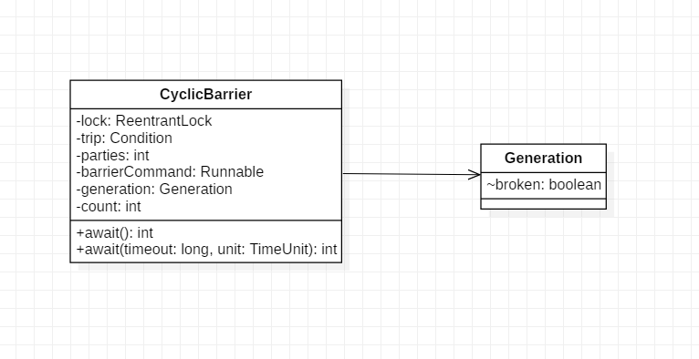
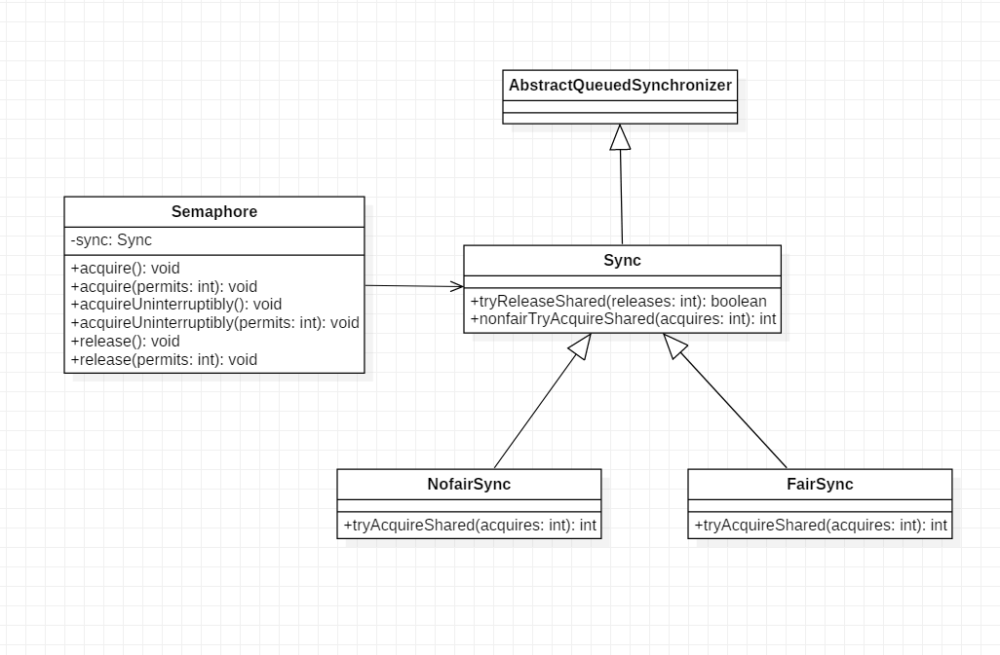

# 第10章 Java并发包中线程同步器原理剖析

## 目录

- [CountDownLatch原理剖析](#countdownlatch原理剖析)
    - [示例](#示例)
    - [类图结构](#类图结构)
    - [源码解析](#源码解析)
        - [void await()](#void-await)
        - [boolean await(long timeout, TimeUnit unit)](#boolean-awaitlong-timeout-timeunit-unit)
        - [void countDown()](#void-countdown)
- [CyclicBarrier原理探究](#cyclicbarrier原理探究)
    - [示例](#示例-1)
    - [类图结构](#类图结构-1)
    - [源码分析](#源码分析)
        - [int await()](#int-await)
        - [boolean await(long timeout, TimeUnit unit)](#boolean-awaitlong-timeout-timeunit-unit-1)
        - [int dowait(boolean timed, long nanos)](#int-dowaitboolean-timed-long-nanos)
- [Semaphore原理探究](#semaphore原理探究)
    - [示例](#示例-2)
    - [类图结构](#类图结构-2)
    - [源码解析](#源码解析-1)
        - [void acquire()](#void-acquire)
        - [void acquire(int permits)](#void-acquireint-permits)
        - [void acquireUninterruptibly()](#void-acquireuninterruptibly)
        - [void acquireUninterruptibly(int permits)](#void-acquireuninterruptiblyint-permits)
        - [void release()](#void-release)
        - [void release(int permits)](#void-releaseint-permits)
- [更多](#更多)

## CountDownLatch原理剖析

日常开发中经常遇到一个线程需要等待一些线程都结束后才能继续向下运行的场景，在CountDownLatch出现之前通常使用join方法来实现，但join方法不够灵活，所以开发了CountDownLatch。

### 示例

```java
public static void main(String[] args) throws InterruptedException {
    CountDownLatch countDownLatch = new CountDownLatch(2);

    ExecutorService executorService = Executors.newFixedThreadPool(2);
    // 添加任务
    executorService.execute(new Runnable() {
        @Override
        public void run() {
            try {
                // 模拟运行时间
                Thread.sleep(1000);
                System.out.println("thread one over...");
            } catch (InterruptedException e) {
                e.printStackTrace();
            }finally {
                // 递减计数器
                countDownLatch.countDown();
            }
        }
    });

    // 同上
    executorService.execute(new Runnable() {
        @Override
        public void run() {
            try {
                Thread.sleep(1000);
                System.out.println("thread two over...");
            } catch (InterruptedException e) {
                e.printStackTrace();
            }finally {
                countDownLatch.countDown();
            }
        }
    });

    System.out.println("wait all child thread over!");
    // 阻塞直到被interrupt或计数器递减至0
    countDownLatch.await();
    System.out.println("all child thread over!");
    executorService.shutdown();
}
```

输出为：

    wait all child thread over!
    thread one over...
    thread two over...
    all child thread over!

CountDownLatch相对于join方法的优点大致有两点：

- 调用一个子线程的join方法后，该线程会一直阻塞直到子线程运行完毕，而CountDownLatch允许子线程运行完毕或在运行过程中递减计数器，也就是说await方法不一定要等到子线程运行结束才返回。
- 使用线程池来管理线程一般都是直接添加Runnable到线程池，这时就没有办法再调用线程的join方法了，而仍可在子线程中递减计数器，也就是说CountDownLatch相比join方法可以更灵活地控制线程的同步。

### 类图结构


由图可知，CountDownLatch是基于AQS实现的。

由下面的代码可知，**CountDownLatch的计数器值就是AQS的state值**。

```java
public CountDownLatch(int count) {
    if (count < 0) throw new IllegalArgumentException("count < 0");
    this.sync = new Sync(count);
}
Sync(int count) {
    setState(count);
}
```

### 源码解析

#### void await()

当线程调用CountDownLatch的await方法后，当前线程会被阻塞，直到CountDownLatch的计数器值递减至0或者其他线程调用了当前线程的interrupt方法。

```java
public void await() throws InterruptedException {
    // 允许中断（中断时抛出异常）
    sync.acquireSharedInterruptibly(1);
}

// AQS的方法
public final void acquireSharedInterruptibly(int arg)
        throws InterruptedException {
    if (Thread.interrupted())
        throw new InterruptedException();
    // state=0时tryAcquireShared方法返回1，直接返回
    // 否则执行doAcquireSharedInterruptibly方法
    if (tryAcquireShared(arg) < 0)
        // state不为0，调用该方法使await方法阻塞
        doAcquireSharedInterruptibly(arg);
}

// Sync的方法（重写了AQS中的该方法）
protected int tryAcquireShared(int acquires) {
    return (getState() == 0) ? 1 : -1;
}

// AQS的方法
private void doAcquireSharedInterruptibly(int arg)
    throws InterruptedException {
    final Node node = addWaiter(Node.SHARED);
    boolean failed = true;
    try {
        for (;;) {
            final Node p = node.predecessor();
            if (p == head) {
                // 获取state值，state=0时r=1，直接返回，不再阻塞
                int r = tryAcquireShared(arg);
                if (r >= 0) {
                    setHeadAndPropagate(node, r);
                    p.next = null; // help GC
                    failed = false;
                    return;
                }
            }
            // 若state不为0则阻塞调用await方法的线程
            // 等到其他线程执行countDown方法使计数器递减至0
            // （state变为0）或该线程被interrupt时
            // 该线程才能继续向下运行
            if (shouldParkAfterFailedAcquire(p, node) &&
                parkAndCheckInterrupt())
                throw new InterruptedException();
        }
    } finally {
        if (failed)
            cancelAcquire(node);
    }
}
```

#### boolean await(long timeout, TimeUnit unit)

相较于上面的await方法，调用此方法后调用线程最多被阻塞timeout时间（单位由unit指定），即使计数器没有递减至0或调用线程没有被interrupt，调用线程也会继续向下运行。

```java
public boolean await(long timeout, TimeUnit unit)
    throws InterruptedException {
    return sync.tryAcquireSharedNanos(1, unit.toNanos(timeout));
}
```

#### void countDown()

递减计数器，当计数器的值为0（即state=0）时会唤醒所有因调用await方法而被阻塞的线程。

```java
public void countDown() {
    // 将计数器减1
    sync.releaseShared(1);
}

// AQS的方法
public final boolean releaseShared(int arg) {
    // 当state被递减至0时tryReleaseShared返回true
    // 会执行doReleaseShared方法唤醒因调用await方法阻塞的线程
    // 否则如果state不是0的话什么也不做
    if (tryReleaseShared(arg)) {
        doReleaseShared();
        return true;
    }
    return false;
}

// Sync重写的AQS中的方法
protected boolean tryReleaseShared(int releases) {
    for (;;) {
        int c = getState();
        // 如果state已经为0，没有递减必要，直接返回
        // 否则会使state变成负数
        if (c == 0)
            return false;
        int nextc = c-1;
        // 通过CAS递减state的值
        if (compareAndSetState(c, nextc))
            // 如果state被递减至0，返回true以进行后续唤醒工作
            return nextc == 0;
    }
}
```

## CyclicBarrier原理探究

CountDownLatch的计数器时一次性的，也就是说当计数器至变为0后，再调用await和countDown方法会直接返回。而CyclicBarrier则解决了此问题。CyclicBarrier是回环屏障的意思，它可以使一组线程全部达到一个状态后再全部同时执行，然后重置自身状态又可用于下一次的状态同步。

### 示例

假设一个任务由阶段1、阶段2、阶段3组成，每个线程要串行地执行阶段1、阶段2、阶段3，当多个线程执行该任务时，必须要保证所有线程的阶段1都执行完毕后才能进入阶段2，当所有线程的阶段2都执行完毕后才能进入阶段3，可用下面的代码实现：

```java
public static void main(String[] args) {
    // 等待两个线程同步
    CyclicBarrier cyclicBarrier = new CyclicBarrier(2);

    ExecutorService executorService = Executors.newFixedThreadPool(2);
    // 运行两个子线程，当两个子线程的step1都执行完毕后才会执行step2
    // 当两个子线程的step2都执行完毕后才会执行step3
    for(int i = 0; i < 2; i++) {
        executorService.execute(new Runnable() {
            @Override
            public void run() {
                try{
                    System.out.println(Thread.currentThread() + " step1");
                    cyclicBarrier.await();
                    System.out.println(Thread.currentThread() + " step2");
                    cyclicBarrier.await();
                    System.out.println(Thread.currentThread() + " step3");
                }catch (Exception e){
                    e.printStackTrace();
                }
            }
        });
    }
    executorService.shutdown();
}
```

输出如下：

    Thread[pool-1-thread-1,5,main] step1
    Thread[pool-1-thread-2,5,main] step1
    Thread[pool-1-thread-1,5,main] step2
    Thread[pool-1-thread-2,5,main] step2
    Thread[pool-1-thread-2,5,main] step3
    Thread[pool-1-thread-1,5,main] step3

### 类图结构



CyclicBarrier基于ReentrantLock实现，本质上还是基于AQS的。parties用于记录线程个数，表示多少个线程调用await方法后，所有线程才会冲破屏障往下运行。count一开始等于parties，当由线程调用await方法时会递减1，当count变成0时到达屏障点，所有调用await的线程会一起往下执行，此时要重置CyclicBarrier，再次令count=parties。

lock用于保证更新计数器count的原子性。lock的条件变量trip用于支持线程间使用await和signalAll进行通信。

以下是CyclicBarrier的构造函数：

```java
public CyclicBarrier(int parties) {
    this(parties, null);
}

// barrierAction为达到屏障点（parties个线程调用了await方法）时执行的任务
public CyclicBarrier(int parties, Runnable barrierAction) {
    if (parties <= 0) throw new IllegalArgumentException();
    this.parties = parties;
    this.count = parties;
    this.barrierCommand = barrierAction;
}
```

Generation的定义如下：

```java
private static class Generation {
    // 记录当前屏障是否可以被打破
    boolean broken = false;
}
```

### 源码分析

#### int await()

当前线程调用该方法时会阻塞，直到满足以下条件之一才会返回：

- parties个线程调用了await方法，也就是到达屏障点
- 其他线程调用了当前线程的interrupt方法
- Generation对象的broken标志被设置为true，抛出BrokenBarrierExecption

```java
public int await() throws InterruptedException, BrokenBarrierException {
    try {
        // false表示不设置超时时间，此时后面参数无意义
        // dowait稍后具体分析
        return dowait(false, 0L);
    } catch (TimeoutException toe) {
        throw new Error(toe); // cannot happen
    }
}
```

####  boolean await(long timeout, TimeUnit unit)

相比于await()，等待超时会返回false。

```java
public int await(long timeout, TimeUnit unit)
    throws InterruptedException,
            BrokenBarrierException,
            TimeoutException {
           // 设置了超时时间
           // dowait稍后分析     
    return dowait(true, unit.toNanos(timeout));
}
```

#### int dowait(boolean timed, long nanos)

```java
private int dowait(boolean timed, long nanos)
    throws InterruptedException, BrokenBarrierException,
            TimeoutException {
    final ReentrantLock lock = this.lock;
    lock.lock();
    try {
        final Generation g = generation;
        // 屏障已被打破则抛出异常
        if (g.broken)
            throw new BrokenBarrierException();

        // 线程中断则抛出异常
        if (Thread.interrupted()) {
            // 打破屏障
            // 会做三件事
            // 1. 设置generation的broken为true
            // 2. 重置count为parites
            // 3. 调用signalAll激活所有等待线程
            breakBarrier();
            throw new InterruptedException();
        }

        int index = --count;
        // 到达了屏障点
        if (index == 0) {
            boolean ranAction = false;
            try {
                final Runnable command = barrierCommand;
                if (command != null)
                    // 执行每一次到达屏障点所需要执行的任务
                    command.run();
                ranAction = true;
                // 重置状态，进入下一次屏障
                nextGeneration();
                return 0;
            } finally {
                if (!ranAction)
                    breakBarrier();
            }
        }

        // 如果index不为0
        // loop until tripped, broken, interrupted, or timed out
        for (;;) {
            try {
                if (!timed)
                    trip.await();
                else if (nanos > 0L)
                    nanos = trip.awaitNanos(nanos);
            } catch (InterruptedException ie) {
                // 执行此处时，有可能其他线程已经调用了nextGeneration方法
                // 此时应该使当前线程正常执行下去
                // 否则打破屏障
                if (g == generation && ! g.broken) {
                    breakBarrier();
                    throw ie;
                } else {
                    // We're about to finish waiting even if we had not
                    // been interrupted, so this interrupt is deemed to
                    // "belong" to subsequent execution.
                    Thread.currentThread().interrupt();
                }
            }

            if (g.broken)
                throw new BrokenBarrierException();
            // 如果此次屏障已经结束，则正常返回
            if (g != generation)
                return index;
            // 如果是因为超时，则打破屏障并抛出异常
            if (timed && nanos <= 0L) {
                breakBarrier();
                throw new TimeoutException();
            }
        }
    } finally {
        lock.unlock();
    }
}

// 打破屏障
private void breakBarrier() {
    // 设置打破标志
    generation.broken = true;
    // 重置count
    count = parties;
    // 唤醒所有等待的线程
    trip.signalAll();
}

private void nextGeneration() {
    // 唤醒当前屏障下所有被阻塞的线程
    trip.signalAll();
    // 重置状态，进入下一次屏障
    count = parties;
    generation = new Generation();
}
```

## Semaphore原理探究

Semaphore信号量也是一个同步器，与CountDownLatch和CyclicBarrier不同的是，它内部的计数器是递增的，并且在初始化时可以指定计数器的初始值（通常为0），但不必知道需要同步的线程个数，而是在需要同步的地方调用acquire方法时指定需要同步的线程个数。

### 示例

```java
public static void main(String[] args) throws InterruptedException {
    final int THREAD_COUNT = 2;
    // 初始信号量为0
    Semaphore semaphore = new Semaphore(0);
    ExecutorService executorService = Executors.newFixedThreadPool(THREAD_COUNT);

    for (int i = 0; i < THREAD_COUNT; i++){
        executorService.execute(new Runnable() {
            @Override
            public void run() {
                System.out.println(Thread.currentThread() + " over");
                // 信号量+1
                semaphore.release();
            }
        });
    }

    // 当信号量达到2时才停止阻塞
    semaphore.acquire(2);
    System.out.println("all child thread over!");

    executorService.shutdown();
}
```

### 类图结构



由图可知，Semaphore还是使用AQS实现的，并且可以选取公平性策略（默认为非公平性的）。

### 源码解析

#### void acquire()

表示当前线程希望获取一个信号量资源，如果当前信号量大于0，则当前信号量的计数减1，然后该方法直接返回。否则如果当前信号量等于0，则被阻塞。

```java
public void acquire() throws InterruptedException {
    sync.acquireSharedInterruptibly(1);
}

public final void acquireSharedInterruptibly(int arg)
        throws InterruptedException {
    // 可以被中断
    if (Thread.interrupted())
        throw new InterruptedException();
    // 调用Sync子类方法尝试获取，这里根据构造函数决定公平策略
    if (tryAcquireShared(arg) < 0)
        // 将当前线程放入阻塞队列，然后再次尝试
        // 如果失败则挂起当前线程
        doAcquireSharedInterruptibly(arg);
}
```

tryAcquireShared由Sync的子类实现以根据公平性采取相应的行为。

以下是非公平策略NofairSync的实现:

```java
protected int tryAcquireShared(int acquires) {
    return nonfairTryAcquireShared(acquires);
}

final int nonfairTryAcquireShared(int acquires) {
    for (;;) {
        int available = getState();
        int remaining = available - acquires;
        // 如果剩余信号量小于0直接返回
        // 否则如果更新信号量成功则返回
        if (remaining < 0 ||
            compareAndSetState(available, remaining))
            return remaining;
    }
}
```

假设线程A调用了acquire方法尝试获取信号量但因信号量不足被阻塞，这时线程B通过release增加了信号量，此时线程C完全可以调用acquire方法成功获取到信号量（如果信号量足够的话），这就是非公平性的体现。

下面是公平性的实现：

```java
protected int tryAcquireShared(int acquires) {
    for (;;) {
        // 关键在于先判断AQS队列中是否已经有元素要获取信号量
        if (hasQueuedPredecessors())
            return -1;
        int available = getState();
        int remaining = available - acquires;
        if (remaining < 0 ||
            compareAndSetState(available, remaining))
            return remaining;
    }
}
```

hasQueuedPredecessors方法（可参看[第6章 Java并发包中锁原理剖析](/06Java并发包中锁原理剖析.md)）用于判断当前线程的前驱节点是否也在等待获取该资源，如果是则自己放弃获取的权限，然后当前线程会被放入AQS中，否则尝试去获取。

#### void acquire(int permits)

可获取多个信号量。

```java
public void acquire(int permits) throws InterruptedException {
    if (permits < 0) throw new IllegalArgumentException();
    sync.acquireSharedInterruptibly(permits);
}
```

#### void acquireUninterruptibly()

不对中断进行响应。

```java
public void acquireUninterruptibly() {
    sync.acquireShared(1);
}
```

#### void acquireUninterruptibly(int permits)

不对中断进行相应并且可获取多个信号量。

```java
public void acquireUninterruptibly(int permits) {
    if (permits < 0) throw new IllegalArgumentException();
    sync.acquireShared(permits);
}
```

#### void release()

使信号量加1，如果当前有线程因为调用acquire方法被阻塞而被放入AQS中的话，会根据公平性策略选择一个信号量个数能被满足的线程进行激活。

```java
public void release() {
    sync.releaseShared(1);
}

public final boolean releaseShared(int arg) {
    // 尝试释放资源（增加信号量）
    if (tryReleaseShared(arg)) {
        // 释放资源成功则根据公平性策略唤醒AQS中阻塞的线程
        doReleaseShared();
        return true;
    }
    return false;
}

protected final boolean tryReleaseShared(int releases) {
    for (;;) {
        int current = getState();
        int next = current + releases;
        if (next < current) // overflow
            throw new Error("Maximum permit count exceeded");
        if (compareAndSetState(current, next))
            return true;
    }
}
```

#### void release(int permits)

可增加多个信号量。

```java
public void release(int permits) {
    if (permits < 0) throw new IllegalArgumentException();
    sync.releaseShared(permits);
}
```

## 更多

相关笔记：[《Java并发编程之美》阅读笔记](/README.md)
